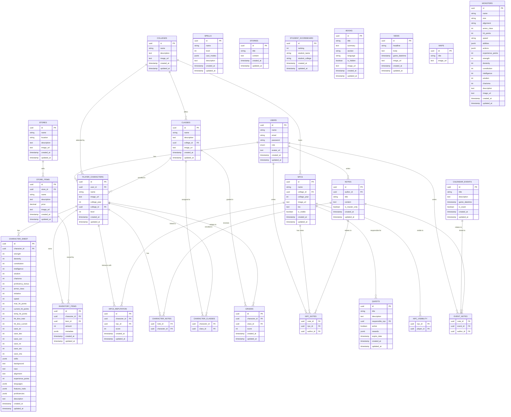

# Data Model

## Enumerations

### `user_role`

-   Possible values: `'DM'`, `'PLAYER'`

---

## Tables

### `users`

| Column     | Type         | Constraints      | Description                |
| ---------- | ------------ | ---------------- | -------------------------- |
| id         | UUID         | PK               | Unique user identifier     |
| name       | VARCHAR(100) | NOT NULL         | User's name                |
| email      | VARCHAR(100) | UNIQUE, NOT NULL | User's email               |
| password   | VARCHAR(255) | NOT NULL         | User's password            |
| role       | `user_role`  | NOT NULL         | User's role (DM or PLAYER) |
| avatar_url | TEXT         |                  | URL to user's avatar image |
| created_at | TIMESTAMP    | DEFAULT NOW()    | Creation timestamp         |
| updated_at | TIMESTAMP    | DEFAULT NOW()    | Update timestamp           |

---

### `colleges`

| Column      | Type         | Constraints   | Description          |
| ----------- | ------------ | ------------- | -------------------- |
| id          | UUID         | PK            | College identifier   |
| name        | VARCHAR(100) | NOT NULL      | College name         |
| description | TEXT         |               | College description  |
| image_url   | TEXT         |               | URL to college image |
| created_at  | TIMESTAMP    | DEFAULT NOW() | Creation timestamp   |
| updated_at  | TIMESTAMP    | DEFAULT NOW() | Update timestamp     |

---

### `books`

| Column     | Type         | Constraints   | Description        |
| ---------- | ------------ | ------------- | ------------------ |
| id         | UUID         | PK            | Book identifier    |
| title      | VARCHAR(100) | NOT NULL      | Book title         |
| summary    | TEXT         |               | Book summary       |
| section    | VARCHAR(100) |               | Book section       |
| language   | VARCHAR(50)  |               | Book language      |
| is_hidden  | BOOLEAN      | DEFAULT FALSE | Visibility flag    |
| image_url  | TEXT         |               | Book image URL     |
| created_at | TIMESTAMP    | DEFAULT NOW() | Creation timestamp |
| updated_at | TIMESTAMP    | DEFAULT NOW() | Update timestamp   |

---

### `maps`

| Column    | Type         | Constraints | Description    |
| --------- | ------------ | ----------- | -------------- |
| id        | UUID         | PK          | Map identifier |
| title     | VARCHAR(100) | NOT NULL    | Map title      |
| image_url | TEXT         |             | Map image URL  |

---

### `monsters`

| Column            | Type         | Constraints   | Description         |
| ----------------- | ------------ | ------------- | ------------------- |
| id                | UUID         | PK            | Monster identifier  |
| name              | VARCHAR(100) | NOT NULL      | Monster name        |
| size              | VARCHAR(50)  |               | Monster size        |
| alignment         | VARCHAR(50)  |               | Alignment           |
| armor_class       | INT          |               | Armor Class         |
| hit_points        | INT          |               | Hit Points          |
| speed             | VARCHAR(50)  |               | Movement speed      |
| abilities         | JSONB        |               | Monster abilities   |
| actions           | JSONB        |               | Monster actions     |
| experience_points | INT          |               | Experience points   |
| strength          | INT          |               | Strength            |
| dexterity         | INT          |               | Dexterity           |
| constitution      | INT          |               | Constitution        |
| intelligence      | INT          |               | Intelligence        |
| wisdom            | INT          |               | Wisdom              |
| charisma          | INT          |               | Charisma            |
| description       | TEXT         |               | Monster description |
| image_url         | TEXT         |               | Monster image URL   |
| created_at        | TIMESTAMP    | DEFAULT NOW() | Creation timestamp  |
| updated_at        | TIMESTAMP    | DEFAULT NOW() | Update timestamp    |

---

### `news`

| Column        | Type         | Constraints   | Description        |
| ------------- | ------------ | ------------- | ------------------ |
| id            | UUID         | PK            | News identifier    |
| headline      | VARCHAR(100) | NOT NULL      | News headline      |
| body          | TEXT         |               | News body          |
| game_datetime | TIMESTAMP    |               | In-game date/time  |
| image_url     | TEXT         |               | News image URL     |
| created_at    | TIMESTAMP    | DEFAULT NOW() | Creation timestamp |
| updated_at    | TIMESTAMP    | DEFAULT NOW() | Update timestamp   |

---

### `stores`

| Column      | Type         | Constraints   | Description        |
| ----------- | ------------ | ------------- | ------------------ |
| id          | UUID         | PK            | Store identifier   |
| name        | VARCHAR(100) | NOT NULL      | Store name         |
| location    | VARCHAR(100) |               | Store location     |
| description | TEXT         |               | Store description  |
| image_url   | TEXT         |               | Store image URL    |
| created_at  | TIMESTAMP    | DEFAULT NOW() | Creation timestamp |
| updated_at  | TIMESTAMP    | DEFAULT NOW() | Update timestamp   |

---

### `calendar_events`

| Column        | Type         | Constraints   | Description        |
| ------------- | ------------ | ------------- | ------------------ |
| id            | UUID         | PK            | Event identifier   |
| title         | VARCHAR(100) | NOT NULL      | Event title        |
| description   | TEXT         |               | Event description  |
| game_datetime | TIMESTAMP    |               | In-game date/time  |
| is_exam       | BOOLEAN      | DEFAULT FALSE | Exam flag          |
| created_at    | TIMESTAMP    | DEFAULT NOW() | Creation timestamp |
| updated_at    | TIMESTAMP    | DEFAULT NOW() | Update timestamp   |

---

### `npcs`

| Column       | Type         | Constraints                             | Description        |
| ------------ | ------------ | --------------------------------------- | ------------------ |
| id           | UUID         | PK                                      | NPC identifier     |
| name         | VARCHAR(100) | NOT NULL                                | NPC name           |
| college_id   | UUID         | FK to `colleges(id)` ON DELETE SET NULL | NPC's college      |
| college_year | INT          |                                         | NPC's college year |
| image_url    | TEXT         |                                         | NPC image URL      |
| bio          | TEXT         |                                         | NPC biography      |
| is_visible   | BOOLEAN      | DEFAULT TRUE                            | Visibility flag    |
| created_at   | TIMESTAMP    | DEFAULT NOW()                           | Creation timestamp |
| updated_at   | TIMESTAMP    | DEFAULT NOW()                           | Update timestamp   |

---

### `player_characters`

| Column       | Type         | Constraints                             | Description          |
| ------------ | ------------ | --------------------------------------- | -------------------- |
| id           | UUID         | PK                                      | Character identifier |
| user_id      | UUID         | FK to `users(id)` ON DELETE CASCADE     | Owning user          |
| name         | VARCHAR(100) | NOT NULL                                | Character name       |
| image_url    | TEXT         |                                         | Character image URL  |
| college_year | INT          |                                         | College year         |
| college_id   | UUID         | FK to `colleges(id)` ON DELETE SET NULL | Character's college  |
| level        | INT          |                                         | Character level      |
| created_at   | TIMESTAMP    | DEFAULT NOW()                           | Creation timestamp   |
| updated_at   | TIMESTAMP    | DEFAULT NOW()                           | Update timestamp     |

---

### `classes`

| Column      | Type         | Constraints                             | Description        |
| ----------- | ------------ | --------------------------------------- | ------------------ |
| id          | UUID         | PK                                      | Class identifier   |
| name        | VARCHAR(100) | NOT NULL                                | Class name         |
| description | TEXT         |                                         | Class description  |
| college_id  | UUID         | FK to `colleges(id)` ON DELETE SET NULL | Associated college |
| image_url   | TEXT         |                                         | Class image URL    |
| created_at  | TIMESTAMP    | DEFAULT NOW()                           | Creation timestamp |
| updated_at  | TIMESTAMP    | DEFAULT NOW()                           | Update timestamp   |

---

### `grades`

| Column       | Type      | Constraints                                     | Description                   |
| ------------ | --------- | ----------------------------------------------- | ----------------------------- |
| id           | UUID      | PK                                              | Grade identifier              |
| character_id | UUID      | FK to `player_characters(id)` ON DELETE CASCADE | Character                     |
| class_id     | UUID      | FK to `classes(id)` ON DELETE CASCADE           | Class                         |
| score        | INT       |                                                 | Grade score                   |
| created_at   | TIMESTAMP | DEFAULT NOW()                                   | Creation timestamp            |
| updated_at   | TIMESTAMP | DEFAULT NOW()                                   | Update timestamp              |
| UNIQUE       |           | (character_id, class_id)                        | One grade per character/class |

---

### `quests`

| Column          | Type         | Constraints                         | Description               |
| --------------- | ------------ | ----------------------------------- | ------------------------- |
| id              | UUID         | PK                                  | Quest identifier          |
| title           | VARCHAR(150) | NOT NULL                            | Quest title               |
| description     | TEXT         |                                     | Quest description         |
| responsible_npc | UUID         | FK to `npcs(id)` ON DELETE SET NULL | NPC responsible for quest |
| active          | BOOLEAN      | DEFAULT TRUE                        | Active flag               |
| rewards         | JSONB        |                                     | Quest rewards             |
| expire_date     | TIMESTAMP    |                                     | Quest expiration date     |
| created_at      | TIMESTAMP    | DEFAULT NOW()                       | Creation timestamp        |
| updated_at      | TIMESTAMP    | DEFAULT NOW()                       | Update timestamp          |

---

### `store_items`

| Column      | Type          | Constraints                          | Description           |
| ----------- | ------------- | ------------------------------------ | --------------------- |
| id          | UUID          | PK                                   | Store item identifier |
| store_id    | UUID          | FK to `stores(id)` ON DELETE CASCADE | Associated store      |
| name        | VARCHAR(100)  | NOT NULL                             | Item name             |
| description | TEXT          |                                      | Item description      |
| price       | DECIMAL(10,2) |                                      | Item price            |
| image_url   | TEXT          |                                      | Item image URL        |
| created_at  | TIMESTAMP     | DEFAULT NOW()                        | Creation timestamp    |
| updated_at  | TIMESTAMP     | DEFAULT NOW()                        | Update timestamp      |

---

### `character_sheet`

| Column             | Type      | Constraints                                             | Description                |
| ------------------ | --------- | ------------------------------------------------------- | -------------------------- |
| id                 | UUID      | PK                                                      | Character sheet identifier |
| character_id       | UUID      | UNIQUE, FK to `player_characters(id)` ON DELETE CASCADE | Associated character       |
| strength           | INT       |                                                         | Strength                   |
| dexterity          | INT       |                                                         | Dexterity                  |
| constitution       | INT       |                                                         | Constitution               |
| intelligence       | INT       |                                                         | Intelligence               |
| wisdom             | INT       |                                                         | Wisdom                     |
| charisma           | INT       |                                                         | Charisma                   |
| proficiency_bonus  | INT       |                                                         | Proficiency bonus          |
| armor_class        | INT       |                                                         | Armor class                |
| initiative         | INT       |                                                         | Initiative                 |
| speed              | INT       |                                                         | Movement speed             |
| max_hit_points     | INT       |                                                         | Maximum hit points         |
| current_hit_points | INT       |                                                         | Current hit points         |
| temp_hit_points    | INT       |                                                         | Temporary hit points       |
| hit_dice_total     | INT       |                                                         | Total hit dice             |
| hit_dice_current   | INT       |                                                         | Current hit dice           |
| save_str           | INT       |                                                         | Strength saving throw      |
| save_dex           | INT       |                                                         | Dexterity saving throw     |
| save_con           | INT       |                                                         | Constitution saving throw  |
| save_int           | INT       |                                                         | Intelligence saving throw  |
| save_wis           | INT       |                                                         | Wisdom saving throw        |
| save_cha           | INT       |                                                         | Charisma saving throw      |
| skills             | JSONB     |                                                         | Skills                     |
| background         | TEXT      |                                                         | Background                 |
| race               | TEXT      |                                                         | Race                       |
| alignment          | TEXT      |                                                         | Alignment                  |
| experience_points  | INT       |                                                         | Experience points          |
| languages          | JSONB     |                                                         | Languages                  |
| features_traits    | JSONB     |                                                         | Features and traits        |
| proficiencies      | JSONB     |                                                         | Proficiencies              |
| description        | TEXT      |                                                         | Description                |
| created_at         | TIMESTAMP | DEFAULT NOW()                                           | Creation timestamp         |
| updated_at         | TIMESTAMP | DEFAULT NOW()                                           | Update timestamp           |

---

### `spells`

| Column      | Type         | Constraints   | Description        |
| ----------- | ------------ | ------------- | ------------------ |
| id          | UUID         | PK            | Spell identifier   |
| name        | VARCHAR(100) | NOT NULL      | Spell name         |
| level       | INT          |               | Spell level        |
| cast_modes  | JSONB        |               | Casting modes      |
| description | TEXT         |               | Spell description  |
| created_at  | TIMESTAMP    | DEFAULT NOW() | Creation timestamp |
| updated_at  | TIMESTAMP    | DEFAULT NOW() | Update timestamp   |

---

### `stories`

| Column     | Type      | Constraints   | Description        |
| ---------- | --------- | ------------- | ------------------ |
| id         | UUID      | PK            | Story identifier   |
| title      | TEXT      |               | Story title        |
| content    | TEXT      |               | Story content      |
| created_at | TIMESTAMP | DEFAULT NOW() | Creation timestamp |
| updated_at | TIMESTAMP | DEFAULT NOW() | Update timestamp   |

---

### `student_scoreboard`

| Column          | Type         | Constraints   | Description         |
| --------------- | ------------ | ------------- | ------------------- |
| id              | UUID         | PK            | Scoreboard entry ID |
| ranking         | INT          |               | Student ranking     |
| student_name    | VARCHAR(100) |               | Student name        |
| student_college | VARCHAR(100) |               | Student's college   |
| created_at      | TIMESTAMP    | DEFAULT NOW() | Creation timestamp  |
| updated_at      | TIMESTAMP    | DEFAULT NOW() | Update timestamp    |

---

### `inventory_items`

| Column       | Type      | Constraints                                     | Description               |
| ------------ | --------- | ----------------------------------------------- | ------------------------- |
| id           | UUID      | PK                                              | Inventory item ID         |
| character_id | UUID      | FK to `player_characters(id)` ON DELETE CASCADE | Owner character           |
| item_id      | UUID      | FK to `store_items(id)` ON DELETE SET NULL      | Item reference            |
| amount       | INT       |                                                 | Quantity                  |
| metadata     | JSONB     |                                                 | Additional metadata       |
| created_at   | TIMESTAMP | DEFAULT NOW()                                   | Creation timestamp        |
| updated_at   | TIMESTAMP | DEFAULT NOW()                                   | Update timestamp          |
| UNIQUE       |           | (character_id, item_id)                         | Unique item per character |

---

### `npcs_reputation`

| Column       | Type      | Constraints                                     | Description                  |
| ------------ | --------- | ----------------------------------------------- | ---------------------------- |
| id           | UUID      | PK                                              | Reputation record ID         |
| character_id | UUID      | FK to `player_characters(id)` ON DELETE CASCADE | Character                    |
| npc_id       | UUID      | FK to `npcs(id)` ON DELETE CASCADE              | NPC                          |
| score        | INT       |                                                 | Reputation score             |
| created_at   | TIMESTAMP | DEFAULT NOW()                                   | Creation timestamp           |
| updated_at   | TIMESTAMP | DEFAULT NOW()                                   | Update timestamp             |
| UNIQUE       |           | (character_id, npc_id)                          | One record per NPC/character |

---

### `notes`

| Column         | Type         | Constraints                         | Description        |
| -------------- | ------------ | ----------------------------------- | ------------------ |
| id             | UUID         | PK                                  | Note identifier    |
| author_id      | UUID         | FK to `users(id)` ON DELETE CASCADE | Note author        |
| title          | VARCHAR(150) |                                     | Note title         |
| content        | TEXT         | NOT NULL                            | Note content       |
| is_master_only | BOOLEAN      | DEFAULT FALSE                       | Master-only flag   |
| created_at     | TIMESTAMP    | DEFAULT NOW()                       | Creation timestamp |
| updated_at     | TIMESTAMP    | DEFAULT NOW()                       | Update timestamp   |

---

### `character_notes`

| Column       | Type | Constraints                                     | Description |
| ------------ | ---- | ----------------------------------------------- | ----------- |
| note_id      | UUID | FK to `notes(id)` ON DELETE CASCADE             | Note        |
| character_id | UUID | FK to `player_characters(id)` ON DELETE CASCADE | Character   |

**Primary Key:** (note_id, character_id)

---

### `npc_notes`

| Column    | Type | Constraints                         | Description |
| --------- | ---- | ----------------------------------- | ----------- |
| note_id   | UUID | FK to `notes(id)` ON DELETE CASCADE | Note        |
| npc_id    | UUID | FK to `npcs(id)` ON DELETE CASCADE  | NPC         |
| author_id | UUID | FK to `users(id)` ON DELETE CASCADE | Author      |

**Primary Key:** (note_id, npc_id)

---

### `npc_visibility`

| Column    | Type | Constraints                         | Description            |
| --------- | ---- | ----------------------------------- | ---------------------- |
| npc_id    | UUID | FK to `npcs(id)` ON DELETE CASCADE  | NPC identifier         |
| player_id | UUID | FK to `users(id)` ON DELETE CASCADE | Player with visibility |

**Primary Key:** (npc_id, player_id)

---

### `character_classes`

| Column       | Type | Constraints                                     | Description  |
| ------------ | ---- | ----------------------------------------------- | ------------ |
| character_id | UUID | FK to `player_characters(id)` ON DELETE CASCADE | Character ID |
| class_id     | UUID | FK to `classes(id)` ON DELETE CASCADE           | Class ID     |

**Primary Key:** (character_id, class_id)

## Mermaid Diagram

