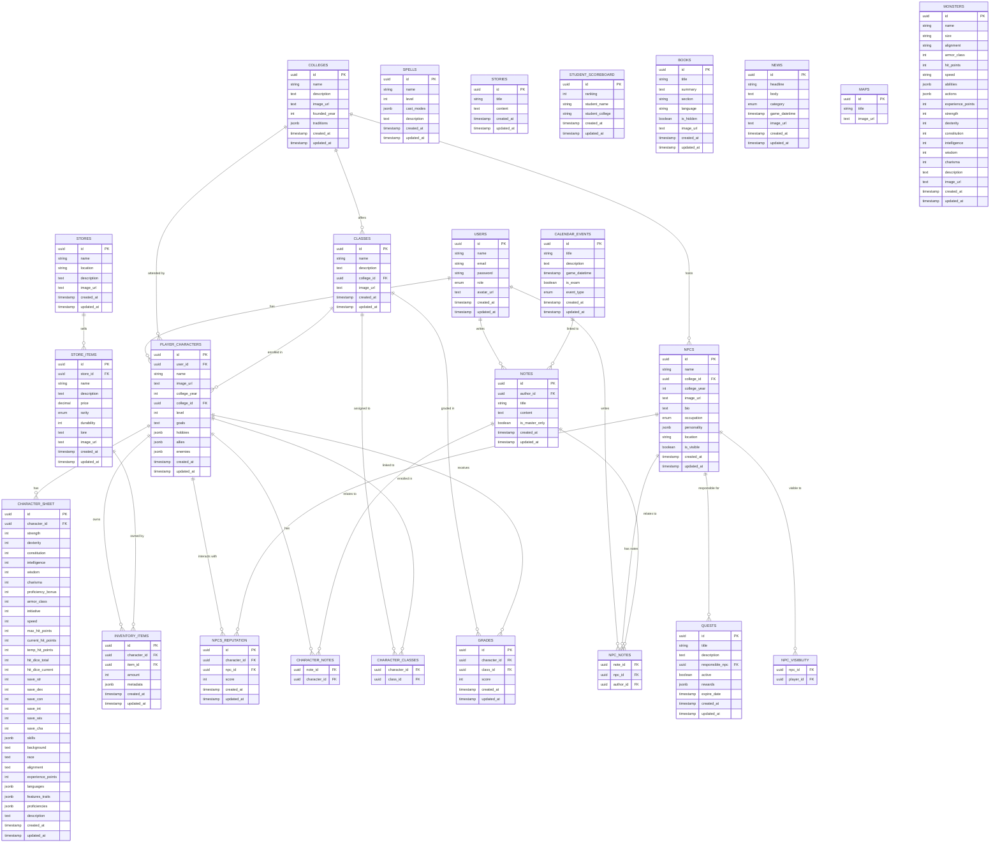

# Data Model

## Enumerations

### `user_role`

* Possible values: `'DM'`, `'PLAYER'`

### `news_category`

* Possible values: `'EVENT'`, `'ANNOUNCEMENT'`, `'UPDATE'`, `'OTHER'`

### `calendar_event_type`

* Possible values: `'CLASS'`, `'EXAM'`, `'HOLIDAY'`, `'OTHER'`

### `store_item_rarity`

* Possible values: `'COMMON'`, `'UNCOMMON'`, `'RARE'`, `'EPIC'`, `'LEGENDARY'`

### `npc_occupation`

* Possible values: `'PROFESSOR'`, `'STUDENT'`, `'MERCHANT'`, `'OTHER'`

---

## Tables

### `users`

| Column      | Type         | Constraints      | Description                |
| ----------- | ------------ | ---------------- | -------------------------- |
| id          | UUID         | PK               | Unique user identifier     |
| name        | VARCHAR(100) | NOT NULL         | User's name                |
| email       | VARCHAR(100) | UNIQUE, NOT NULL | User's email               |
| password    | VARCHAR(255) | NOT NULL         | User's password            |
| role        | `user_role`  | NOT NULL         | User's role                |
| avatar\_url | TEXT         |                  | URL to user's avatar image |
| created\_at | TIMESTAMP    | DEFAULT NOW()    | Creation timestamp         |
| updated\_at | TIMESTAMP    | DEFAULT NOW()    | Update timestamp           |

---

### `colleges`

| Column        | Type         | Constraints   | Description          |
| ------------- | ------------ | ------------- | -------------------- |
| id            | UUID         | PK            | College identifier   |
| name          | VARCHAR(100) | NOT NULL      | College name         |
| description   | TEXT         |               | College description  |
| image\_url    | TEXT         |               | URL to college image |
| founded\_year | INT          |               | Year college founded |
| traditions    | JSONB        |               | College traditions   |
| created\_at   | TIMESTAMP    | DEFAULT NOW() | Creation timestamp   |
| updated\_at   | TIMESTAMP    | DEFAULT NOW() | Update timestamp     |

---

### `books`

| Column      | Type         | Constraints   | Description        |
| ----------- | ------------ | ------------- | ------------------ |
| id          | UUID         | PK            | Book identifier    |
| title       | VARCHAR(100) | NOT NULL      | Book title         |
| summary     | TEXT         |               | Book summary       |
| section     | VARCHAR(100) |               | Book section       |
| language    | VARCHAR(50)  |               | Book language      |
| is\_hidden  | BOOLEAN      | DEFAULT FALSE | Visibility flag    |
| image\_url  | TEXT         |               | Book image URL     |
| created\_at | TIMESTAMP    | DEFAULT NOW() | Creation timestamp |
| updated\_at | TIMESTAMP    | DEFAULT NOW() | Update timestamp   |

---

### `maps`

| Column     | Type         | Constraints | Description    |
| ---------- | ------------ | ----------- | -------------- |
| id         | UUID         | PK          | Map identifier |
| title      | VARCHAR(100) | NOT NULL    | Map title      |
| image\_url | TEXT         |             | Map image URL  |

---

### `monsters`

| Column             | Type         | Constraints   | Description         |
| ------------------ | ------------ | ------------- | ------------------- |
| id                 | UUID         | PK            | Monster identifier  |
| name               | VARCHAR(100) | NOT NULL      | Monster name        |
| size               | VARCHAR(50)  |               | Monster size        |
| alignment          | VARCHAR(50)  |               | Alignment           |
| armor\_class       | INT          |               | Armor Class         |
| hit\_points        | INT          |               | Hit Points          |
| speed              | VARCHAR(50)  |               | Movement speed      |
| abilities          | JSONB        |               | Monster abilities   |
| actions            | JSONB        |               | Monster actions     |
| experience\_points | INT          |               | Experience points   |
| strength           | INT          |               | Strength            |
| dexterity          | INT          |               | Dexterity           |
| constitution       | INT          |               | Constitution        |
| intelligence       | INT          |               | Intelligence        |
| wisdom             | INT          |               | Wisdom              |
| charisma           | INT          |               | Charisma            |
| description        | TEXT         |               | Monster description |
| image\_url         | TEXT         |               | Monster image URL   |
| created\_at        | TIMESTAMP    | DEFAULT NOW() | Creation timestamp  |
| updated\_at        | TIMESTAMP    | DEFAULT NOW() | Update timestamp    |

---

### `news`

| Column         | Type            | Constraints   | Description        |
| -------------- | --------------- | ------------- | ------------------ |
| id             | UUID            | PK            | News identifier    |
| headline       | VARCHAR(100)    | NOT NULL      | News headline      |
| body           | TEXT            |               | News body          |
| category       | `news_category` |               | News category      |
| game\_datetime | TIMESTAMP       |               | In-game date/time  |
| image\_url     | TEXT            |               | News image URL     |
| created\_at    | TIMESTAMP       | DEFAULT NOW() | Creation timestamp |
| updated\_at    | TIMESTAMP       | DEFAULT NOW() | Update timestamp   |

---

### `stores`

| Column      | Type         | Constraints   | Description        |
| ----------- | ------------ | ------------- | ------------------ |
| id          | UUID         | PK            | Store identifier   |
| name        | VARCHAR(100) | NOT NULL      | Store name         |
| location    | VARCHAR(100) |               | Store location     |
| description | TEXT         |               | Store description  |
| image\_url  | TEXT         |               | Store image URL    |
| created\_at | TIMESTAMP    | DEFAULT NOW() | Creation timestamp |
| updated\_at | TIMESTAMP    | DEFAULT NOW() | Update timestamp   |

---

### `calendar_events`

| Column         | Type                  | Constraints   | Description        |
| -------------- | --------------------- | ------------- | ------------------ |
| id             | UUID                  | PK            | Event identifier   |
| title          | VARCHAR(100)          | NOT NULL      | Event title        |
| description    | TEXT                  |               | Event description  |
| game\_datetime | TIMESTAMP             |               | In-game date/time  |
| is\_exam       | BOOLEAN               | DEFAULT FALSE | Exam flag          |
| event\_type    | `calendar_event_type` |               | Type of event      |
| created\_at    | TIMESTAMP             | DEFAULT NOW() | Creation timestamp |
| updated\_at    | TIMESTAMP             | DEFAULT NOW() | Update timestamp   |

---

### `npcs`

| Column        | Type             | Constraints                             | Description        |
| ------------- | ---------------- | --------------------------------------- | ------------------ |
| id            | UUID             | PK                                      | NPC identifier     |
| name          | VARCHAR(100)     | NOT NULL                                | NPC name           |
| college\_id   | UUID             | FK to `colleges(id)` ON DELETE SET NULL | NPC's college      |
| college\_year | INT              |                                         | NPC's college year |
| image\_url    | TEXT             |                                         | NPC image URL      |
| bio           | TEXT             |                                         | NPC biography      |
| occupation    | `npc_occupation` |                                         | NPC occupation     |
| personality   | JSONB            |                                         | NPC personality    |
| location      | VARCHAR(100)     |                                         | NPC location       |
| is\_visible   | BOOLEAN          | DEFAULT TRUE                            | Visibility flag    |
| created\_at   | TIMESTAMP        | DEFAULT NOW()                           | Creation timestamp |
| updated\_at   | TIMESTAMP        | DEFAULT NOW()                           | Update timestamp   |

---

### `player_characters`

| Column        | Type         | Constraints                             | Description          |
| ------------- | ------------ | --------------------------------------- | -------------------- |
| id            | UUID         | PK                                      | Character identifier |
| user\_id      | UUID         | FK to `users(id)` ON DELETE CASCADE     | Owning user          |
| name          | VARCHAR(100) | NOT NULL                                | Character name       |
| image\_url    | TEXT         |                                         | Character image URL  |
| college\_year | INT          |                                         | College year         |
| college\_id   | UUID         | FK to `colleges(id)` ON DELETE SET NULL | Character's college  |
| level         | INT          |                                         | Character level      |
| goals         | TEXT         |                                         | Character goals      |
| hobbies       | JSONB        |                                         | Character hobbies    |
| allies        | JSONB        |                                         | Allies               |
| enemies       | JSONB        |                                         | Enemies              |
| created\_at   | TIMESTAMP    | DEFAULT NOW()                           | Creation timestamp   |
| updated\_at   | TIMESTAMP    | DEFAULT NOW()                           | Update timestamp     |

---

### `classes`

| Column      | Type         | Constraints                             | Description        |
| ----------- | ------------ | --------------------------------------- | ------------------ |
| id          | UUID         | PK                                      | Class identifier   |
| name        | VARCHAR(100) | NOT NULL                                | Class name         |
| description | TEXT         |                                         | Class description  |
| college\_id | UUID         | FK to `colleges(id)` ON DELETE SET NULL | Associated college |
| image\_url  | TEXT         |                                         | Class image URL    |
| created\_at | TIMESTAMP    | DEFAULT NOW()                           | Creation timestamp |
| updated\_at | TIMESTAMP    | DEFAULT NOW()                           | Update timestamp   |

---

### `class_professors`

| Column    | Type | Constraints                           | Description      |
| --------- | ---- | ------------------------------------- | ---------------- |
| class\_id | UUID | FK to `classes(id)` ON DELETE CASCADE | Associated class |
| npc\_id   | UUID | FK to `npcs(id)` ON DELETE CASCADE    | Professor NPC    |

**Primary Key:** (class\_id, npc\_id)

---

### `grades`

| Column        | Type      | Constraints                                     | Description        |
| ------------- | --------- | ----------------------------------------------- | ------------------ |
| id            | UUID      | PK                                              | Grade identifier   |
| character\_id | UUID      | FK to `player_characters(id)` ON DELETE CASCADE | Character graded   |
| class\_id     | UUID      | FK to `classes(id)` ON DELETE CASCADE           | Related class      |
| score         | INT       |                                                 | Numeric score      |
| created\_at   | TIMESTAMP | DEFAULT NOW()                                   | Creation timestamp |
| updated\_at   | TIMESTAMP | DEFAULT NOW()                                   | Update timestamp   |

**Unique:** (character\_id, class\_id)

---

### `quests`

| Column           | Type         | Constraints                         | Description        |
| ---------------- | ------------ | ----------------------------------- | ------------------ |
| id               | UUID         | PK                                  | Quest identifier   |
| title            | VARCHAR(150) | NOT NULL                            | Quest title        |
| description      | TEXT         |                                     | Quest description  |
| responsible\_npc | UUID         | FK to `npcs(id)` ON DELETE SET NULL | NPC responsible    |
| active           | BOOLEAN      | DEFAULT TRUE                        | Active flag        |
| rewards          | JSONB        |                                     | Rewards metadata   |
| expire\_date     | TIMESTAMP    |                                     | Expiration date    |
| created\_at      | TIMESTAMP    | DEFAULT NOW()                       | Creation timestamp |
| updated\_at      | TIMESTAMP    | DEFAULT NOW()                       | Update timestamp   |

---

### `store_items`

| Column      | Type                | Constraints                          | Description           |
| ----------- | ------------------- | ------------------------------------ | --------------------- |
| id          | UUID                | PK                                   | Store item identifier |
| store\_id   | UUID                | FK to `stores(id)` ON DELETE CASCADE | Owning store          |
| name        | VARCHAR(100)        | NOT NULL                             | Item name             |
| description | TEXT                |                                      | Item description      |
| price       | DECIMAL(10,2)       |                                      | Price                 |
| rarity      | `store_item_rarity` |                                      | Item rarity           |
| durability  | INT                 |                                      | Durability/uses       |
| lore        | TEXT                |                                      | Item lore/flavor      |
| image\_url  | TEXT                |                                      | Item image URL        |
| created\_at | TIMESTAMP           | DEFAULT NOW()                        | Creation timestamp    |
| updated\_at | TIMESTAMP           | DEFAULT NOW()                        | Update timestamp      |

---

### `item_identifications`

| Column         | Type      | Constraints                                      | Description                |
| -------------- | --------- | ------------------------------------------------ | -------------------------- |
| id             | UUID      | PK                                               | Identification identifier  |
| item\_id       | UUID      | FK to `store_items(id)` ON DELETE CASCADE        | Identified item            |
| character\_id  | UUID      | FK to `player_characters(id)` ON DELETE SET NULL | Discovering character      |
| discovered\_at | TIMESTAMP | DEFAULT NOW()                                    | Discovery timestamp        |
| notes          | TEXT      |                                                  | Notes about identification |

---

### `character_sheet`

| Column               | Type      | Constraints                                             | Description             |
| -------------------- | --------- | ------------------------------------------------------- | ----------------------- |
| id                   | UUID      | PK                                                      | Sheet identifier        |
| character\_id        | UUID      | UNIQUE, FK to `player_characters(id)` ON DELETE CASCADE | Related character       |
| strength             | INTEGER   |                                                         | STR                     |
| dexterity            | INTEGER   |                                                         | DEX                     |
| constitution         | INTEGER   |                                                         | CON                     |
| intelligence         | INTEGER   |                                                         | INT                     |
| wisdom               | INTEGER   |                                                         | WIS                     |
| charisma             | INTEGER   |                                                         | CHA                     |
| proficiency\_bonus   | INTEGER   |                                                         | Proficiency bonus       |
| armor\_class         | INTEGER   |                                                         | Armor Class             |
| initiative           | INTEGER   |                                                         | Initiative              |
| speed                | INTEGER   |                                                         | Speed                   |
| max\_hit\_points     | INTEGER   |                                                         | Max HP                  |
| current\_hit\_points | INTEGER   |                                                         | Current HP              |
| temp\_hit\_points    | INTEGER   |                                                         | Temporary HP            |
| hit\_dice\_total     | INTEGER   |                                                         | Total hit dice          |
| hit\_dice\_current   | INTEGER   |                                                         | Current hit dice        |
| save\_str            | INTEGER   |                                                         | STR save                |
| save\_dex            | INTEGER   |                                                         | DEX save                |
| save\_con            | INTEGER   |                                                         | CON save                |
| save\_int            | INTEGER   |                                                         | INT save                |
| save\_wis            | INTEGER   |                                                         | WIS save                |
| save\_cha            | INTEGER   |                                                         | CHA save                |
| skills               | JSONB     |                                                         | Skill profs/bonuses     |
| background           | TEXT      |                                                         | Background              |
| race                 | TEXT      |                                                         | Race                    |
| alignment            | TEXT      |                                                         | Alignment               |
| experience\_points   | INTEGER   |                                                         | XP                      |
| languages            | JSONB     |                                                         | Known languages         |
| features\_traits     | JSONB     |                                                         | Features & traits       |
| proficiencies        | JSONB     |                                                         | Weapon/tool/armor profs |
| description          | TEXT      |                                                         | Free-form description   |
| created\_at          | TIMESTAMP | DEFAULT NOW()                                           | Creation timestamp      |
| updated\_at          | TIMESTAMP | DEFAULT NOW()                                           | Update timestamp        |

---

### `spells`

| Column      | Type         | Constraints   | Description            |
| ----------- | ------------ | ------------- | ---------------------- |
| id          | UUID         | PK            | Spell identifier       |
| name        | VARCHAR(100) | NOT NULL      | Spell name             |
| level       | INT          |               | Spell level            |
| cast\_modes | JSONB        |               | Casting modes/variants |
| description | TEXT         |               | Spell description      |
| created\_at | TIMESTAMP    | DEFAULT NOW() | Creation timestamp     |
| updated\_at | TIMESTAMP    | DEFAULT NOW() | Update timestamp       |

---

### `stories`

| Column      | Type         | Constraints   | Description      |
| ----------- | ------------ | ------------- | ---------------- |
| id          | UUID         | PK            | Story identifier |
| title       | VARCHAR(150) |               | Story title      |
| content     | TEXT         |               | Story content    |
| created\_at | TIMESTAMP    | DEFAULT NOW() | Creation time    |
| updated\_at | TIMESTAMP    | DEFAULT NOW() | Update time      |

---

### `clubs`

| Column      | Type         | Constraints                            | Description      |
| ----------- | ------------ | -------------------------------------- | ---------------- |
| id          | UUID         | PK                                     | Club identifier  |
| name        | VARCHAR(100) | NOT NULL                               | Club name        |
| description | TEXT         |                                        | Club description |
| college\_id | UUID         | FK to `colleges(id)` ON DELETE CASCADE | College owner    |
| created\_at | TIMESTAMP    | DEFAULT NOW()                          | Creation time    |
| updated\_at | TIMESTAMP    | DEFAULT NOW()                          | Update time      |

---

### `character_clubs`

| Column        | Type | Constraints                                     | Description      |
| ------------- | ---- | ----------------------------------------------- | ---------------- |
| character\_id | UUID | FK to `player_characters(id)` ON DELETE CASCADE | Character member |
| club\_id      | UUID | FK to `clubs(id)` ON DELETE CASCADE             | Club             |

**Primary Key:** (character\_id, club\_id)

---

### `pets`

| Column      | Type         | Constraints                                     | Description       |
| ----------- | ------------ | ----------------------------------------------- | ----------------- |
| id          | UUID         | PK                                              | Pet identifier    |
| owner\_id   | UUID         | FK to `player_characters(id)` ON DELETE CASCADE | Owning character  |
| name        | VARCHAR(100) | NOT NULL                                        | Pet name          |
| species     | VARCHAR(100) |                                                 | Species           |
| description | TEXT         |                                                 | Pet description   |
| abilities   | JSONB        |                                                 | Special abilities |
| created\_at | TIMESTAMP    | DEFAULT NOW()                                   | Creation time     |
| updated\_at | TIMESTAMP    | DEFAULT NOW()                                   | Update time       |

---

### `tournaments`

| Column      | Type         | Constraints   | Description           |
| ----------- | ------------ | ------------- | --------------------- |
| id          | UUID         | PK            | Tournament identifier |
| title       | VARCHAR(100) | NOT NULL      | Tournament title      |
| description | TEXT         |               | Description           |
| event\_date | TIMESTAMP    |               | Event date/time       |
| created\_at | TIMESTAMP    | DEFAULT NOW() | Creation time         |
| updated\_at | TIMESTAMP    | DEFAULT NOW() | Update time           |

---

### `tournament_results`

| Column         | Type  | Constraints                                     | Description     |
| -------------- | ----- | ----------------------------------------------- | --------------- |
| tournament\_id | UUID  | FK to `tournaments(id)` ON DELETE CASCADE       | Tournament      |
| character\_id  | UUID  | FK to `player_characters(id)` ON DELETE CASCADE | Participant     |
| position       | INT   |                                                 | Final position  |
| reward         | JSONB |                                                 | Reward metadata |

**Primary Key:** (tournament\_id, character\_id)

---

### `student_scoreboard`

| Column           | Type         | Constraints   | Description            |
| ---------------- | ------------ | ------------- | ---------------------- |
| id               | UUID         | PK            | Scoreboard entry id    |
| ranking          | INT          |               | Rank position          |
| student\_name    | VARCHAR(100) |               | Student name           |
| student\_college | VARCHAR(100) |               | Student college (text) |
| created\_at      | TIMESTAMP    | DEFAULT NOW() | Creation time          |
| updated\_at      | TIMESTAMP    | DEFAULT NOW() | Update time            |

---

### `inventory_items`

| Column        | Type      | Constraints                                     | Description           |
| ------------- | --------- | ----------------------------------------------- | --------------------- |
| id            | UUID      | PK                                              | Inventory item id     |
| character\_id | UUID      | FK to `player_characters(id)` ON DELETE CASCADE | Owning character      |
| item\_id      | UUID      | FK to `store_items(id)` ON DELETE SET NULL      | Referenced store item |
| amount        | INT       |                                                 | Quantity              |
| metadata      | JSONB     |                                                 | Extra item metadata   |
| created\_at   | TIMESTAMP | DEFAULT NOW()                                   | Creation time         |
| updated\_at   | TIMESTAMP | DEFAULT NOW()                                   | Update time           |

**Unique:** (character\_id, item\_id)

---

### `npcs_reputation`

| Column        | Type      | Constraints                                     | Description      |
| ------------- | --------- | ----------------------------------------------- | ---------------- |
| id            | UUID      | PK                                              | Reputation id    |
| character\_id | UUID      | FK to `player_characters(id)` ON DELETE CASCADE | Character        |
| npc\_id       | UUID      | FK to `npcs(id)` ON DELETE CASCADE              | NPC              |
| score         | INT       |                                                 | Reputation score |
| created\_at   | TIMESTAMP | DEFAULT NOW()                                   | Creation time    |
| updated\_at   | TIMESTAMP | DEFAULT NOW()                                   | Update time      |

**Unique:** (character\_id, npc\_id)

---

### `notes`

| Column           | Type         | Constraints                         | Description             |
| ---------------- | ------------ | ----------------------------------- | ----------------------- |
| id               | UUID         | PK                                  | Note identifier         |
| author\_id       | UUID         | FK to `users(id)` ON DELETE CASCADE | Author user             |
| title            | VARCHAR(150) |                                     | Note title              |
| content          | TEXT         | NOT NULL                            | Note content            |
| is\_master\_only | BOOLEAN      | DEFAULT FALSE                       | Visible to DM only flag |
| created\_at      | TIMESTAMP    | DEFAULT NOW()                       | Creation time           |
| updated\_at      | TIMESTAMP    | DEFAULT NOW()                       | Update time             |

---

### `character_notes`

| Column        | Type | Constraints                                     | Description      |
| ------------- | ---- | ----------------------------------------------- | ---------------- |
| note\_id      | UUID | FK to `notes(id)` ON DELETE CASCADE             | Linked note      |
| character\_id | UUID | FK to `player_characters(id)` ON DELETE CASCADE | Target character |

**Primary Key:** (note\_id, character\_id)

---

### `npc_notes`

| Column     | Type | Constraints                         | Description |
| ---------- | ---- | ----------------------------------- | ----------- |
| note\_id   | UUID | FK to `notes(id)` ON DELETE CASCADE | Linked note |
| npc\_id    | UUID | FK to `npcs(id)` ON DELETE CASCADE  | Target NPC  |
| author\_id | UUID | FK to `users(id)` ON DELETE CASCADE | Author user |

**Primary Key:** (note\_id, npc\_id)

---

### `npc_visibility`

| Column     | Type | Constraints                         | Description                 |
| ---------- | ---- | ----------------------------------- | --------------------------- |
| npc\_id    | UUID | FK to `npcs(id)` ON DELETE CASCADE  | NPC                         |
| player\_id | UUID | FK to `users(id)` ON DELETE CASCADE | Player user with visibility |

**Primary Key:** (npc\_id, player\_id)

---

### `character_classes`

| Column        | Type | Constraints                                     | Description |
| ------------- | ---- | ----------------------------------------------- | ----------- |
| character\_id | UUID | FK to `player_characters(id)` ON DELETE CASCADE | Character   |
| class\_id     | UUID | FK to `classes(id)` ON DELETE CASCADE           | Class       |

**Primary Key:** (character\_id, class\_id)

---

## Mermaid Diagram

