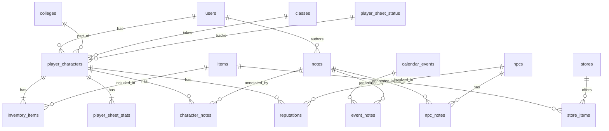

# Data Models

Below are the core tables, their columns, and an explanation of their relationships. At the end, you'll find a Mermaid ER diagram for visual reference.

---

## users

| Column   | Type       | Constraints                      |
| -------- | ---------- | -------------------------------- |
| id       | uuid       | PK, default: `gen_random_uuid()` |
| name     | varchar    | NOT NULL                         |
| email    | varchar    | NOT NULL, UNIQUE                 |
| password | text       | NOT NULL                         |
| role     | user\_role | NOT NULL (enum: DM, PLAYER)      |

**Relationships**:

* One-to-many ⚑ `users.id` → `player_characters.user_id`
* One-to-many ⚑ `users.id` → `notes.author_id`

---

## player\_characters

| Column            | Type     | Constraints                      |
| ----------------- | -------- | -------------------------------- |
| id                | uuid     | PK, default: `gen_random_uuid()` |
| user\_id          | uuid     | FK → `users.id`                  |
| name              | varchar  | NOT NULL                         |
| college\_year     | smallint | NOT NULL                         |
| college\_id       | uuid     | FK → `colleges.id`               |
| class\_id         | uuid     | FK → `classes.id`                |
| level             | smallint | NOT NULL, default: 1             |
| sheet\_status\_id | int      | FK → `player_sheet_status.id`    |

**Relationships**:

* Many-to-one ⚑ `player_characters.user_id` → `users.id`
* Many-to-one ⚑ `player_characters.college_id` → `colleges.id`
* Many-to-one ⚑ `player_characters.class_id` → `classes.id`
* Many-to-one ⚑ `player_characters.sheet_status_id` → `player_sheet_status.id`
* One-to-one ⚑ `player_characters.id` → `player_sheet_stats.character_id`
* One-to-many ⚑ `player_characters.id` → `inventory_items.character_id`
* Many-to-many via `reputations` with `npcs`
* Many-to-many via `character_notes` with `notes`

---

## player\_sheet\_stats

| Column                                                            | Type             | Constraints                      |
| ----------------------------------------------------------------- | ---------------- | -------------------------------- |
| id                                                                | uuid             | PK, default: `gen_random_uuid()` |
| character\_id                                                     | uuid             | FK → `player_characters.id`      |
| strength, dexterity, constitution, intelligence, wisdom, charisma | smallint each    | NOT NULL, 1–30 range             |
| proficiency\_bonus                                                | smallint         | NOT NULL                         |
| armor\_class                                                      | smallint         | NOT NULL                         |
| initiative                                                        | smallint         | NOT NULL                         |
| speed                                                             | smallint         | NOT NULL                         |
| max\_hit\_points                                                  | smallint         | NOT NULL                         |
| current\_hit\_points                                              | smallint         | NOT NULL                         |
| temp\_hit\_points                                                 | smallint         | NOT NULL, default: 0             |
| hit\_dice\_total                                                  | varchar          | NOT NULL                         |
| hit\_dice\_current                                                | smallint         | NOT NULL                         |
| save\_str, save\_dex, save\_con, save\_int, save\_wis, save\_cha  | boolean each     | NOT NULL, default: false         |
| skills                                                            | jsonb            | NOT NULL                         |
| background, race, alignment                                       | varchar each     | NOT NULL                         |
| experience\_points                                                | integer          | NOT NULL, default: 0             |
| languages                                                         | text\[]          | NOT NULL                         |
| features\_traits                                                  | jsonb            | NOT NULL                         |
| proficiencies                                                     | text\[]          | NOT NULL                         |
| created\_at, updated\_at                                          | timestamptz each | NOT NULL, default: now()         |

**Relationships**:

* One-to-one ⚑ `player_sheet_stats.character_id` → `player_characters.id`

---

## inventory\_items

| Column        | Type    | Constraints                      |
| ------------- | ------- | -------------------------------- |
| id            | uuid    | PK, default: `gen_random_uuid()` |
| character\_id | uuid    | FK → `player_characters.id`      |
| item\_id      | uuid    | FK → `items.id`                  |
| quantity      | integer | default: 1                       |
| metadata      | jsonb   |                                  |

**Relationships**:

* Many-to-one ⚑ `inventory_items.character_id` → `player_characters.id`
* Many-to-one ⚑ `inventory_items.item_id` → `items.id`

---

## items

| Column      | Type    | Constraints                      |
| ----------- | ------- | -------------------------------- |
| id          | uuid    | PK, default: `gen_random_uuid()` |
| name        | varchar | NOT NULL                         |
| description | text    |                                  |

**Relationships**:

* One-to-many ⚑ `items.id` → `inventory_items.item_id`
* One-to-many ⚑ `items.id` → `store_items.item_id`

---

## stores

| Column   | Type    | Constraints                      |
| -------- | ------- | -------------------------------- |
| id       | uuid    | PK, default: `gen_random_uuid()` |
| name     | varchar | NOT NULL                         |
| location | varchar |                                  |

**Relationships**:

* One-to-many ⚑ `stores.id` → `store_items.store_id`

---

## store\_items

| Column    | Type    | Constraints                      |
| --------- | ------- | -------------------------------- |
| id        | uuid    | PK, default: `gen_random_uuid()` |
| store\_id | uuid    | FK → `stores.id`                 |
| item\_id  | uuid    | FK → `items.id`                  |
| price     | numeric | NOT NULL                         |

**Relationships**:

* Many-to-one ⚑ `store_items.store_id` → `stores.id`
* Many-to-one ⚑ `store_items.item_id` → `items.id`

---

## colleges

| Column      | Type    | Constraints                      |
| ----------- | ------- | -------------------------------- |
| id          | uuid    | PK, default: `gen_random_uuid()` |
| name        | varchar | NOT NULL                         |
| description | text    |                                  |

**Relationships**:

* One-to-many ⚑ `colleges.id` → `player_characters.college_id`

---

## classes

| Column      | Type    | Constraints                      |
| ----------- | ------- | -------------------------------- |
| id          | uuid    | PK, default: `gen_random_uuid()` |
| name        | varchar |                                  |
| description | text    | NOT NULL                         |

**Relationships**:

* One-to-many ⚑ `classes.id` → `player_characters.class_id`

---

## player\_sheet\_status

| Column | Type    | Constraints |
| ------ | ------- | ----------- |
| id     | serial  | PK          |
| name   | varchar | NOT NULL    |

**Relationships**:

* One-to-many ⚑ `player_sheet_status.id` → `player_characters.sheet_status_id`

---

## npcs

| Column     | Type    | Constraints                      |
| ---------- | ------- | -------------------------------- |
| id         | uuid    | PK, default: `gen_random_uuid()` |
| name       | varchar | NOT NULL                         |
| bio        | text    |                                  |
| is\_secret | boolean | NOT NULL, default: true          |

**Relationships**:

* Many-to-many via `reputations` with `player_characters`
* Many-to-many via `npc_notes` with `notes`

---

## reputations

| Column        | Type     | Constraints                      |
| ------------- | -------- | -------------------------------- |
| id            | uuid     | PK, default: `gen_random_uuid()` |
| character\_id | uuid     | FK → `player_characters.id`      |
| npc\_id       | uuid     | FK → `npcs.id`                   |
| score         | smallint | default: 0                       |

**Relationships**:

* Many-to-one ⚑ `reputations.character_id` → `player_characters.id`
* Many-to-one ⚑ `reputations.npc_id` → `npcs.id`

---

## calendar\_events

| Column         | Type        | Constraints                      |
| -------------- | ----------- | -------------------------------- |
| id             | uuid        | PK, default: `gen_random_uuid()` |
| title          | varchar     | NOT NULL                         |
| description    | text        |                                  |
| game\_datetime | timestamptz | NOT NULL                         |
| is\_exam       | boolean     | default: false                   |

**Relationships**:

* Many-to-many via `event_notes` with `notes`

---

## notes

| Column           | Type        | Constraints                      |
| ---------------- | ----------- | -------------------------------- |
| id               | uuid        | PK, default: `gen_random_uuid()` |
| author\_id       | uuid        | FK → `users.id`                  |
| content          | text        | NOT NULL                         |
| is\_master\_only | boolean     | default: false                   |
| is\_player\_only | boolean     | default: true                    |
| created\_at      | timestamptz | default: now()                   |
| updated\_at      | timestamptz | default: now()                   |

**Relationships**:

* One-to-many ⚑ `notes.id` → `character_notes.note_id`
* One-to-many ⚑ `notes.id` → `npc_notes.note_id`
* One-to-many ⚑ `notes.id` → `event_notes.note_id`
* Many-to-one ⚑ `notes.author_id` → `users.id`

---

## character\_notes

| Column        | Type | Constraints                     |
| ------------- | ---- | ------------------------------- |
| note\_id      | uuid | PK, FK → `notes.id`             |
| character\_id | uuid | PK, FK → `player_characters.id` |

*Join table linking character notes.*

---

## npc\_notes

| Column   | Type | Constraints         |
| -------- | ---- | ------------------- |
| note\_id | uuid | PK, FK → `notes.id` |
| npc\_id  | uuid | PK, FK → `npcs.id`  |

*Join table linking NPC notes.*

---

## event\_notes

| Column    | Type | Constraints                   |
| --------- | ---- | ----------------------------- |
| note\_id  | uuid | PK, FK → `notes.id`           |
| event\_id | uuid | PK, FK → `calendar_events.id` |

*Join table linking event notes.*

---

## books

| Column  | Type    | Constraints                      |
| ------- | ------- | -------------------------------- |
| id      | uuid    | PK, default: `gen_random_uuid()` |
| title   | varchar | NOT NULL                         |
| section | varchar |                                  |
| summary | text    |                                  |

*Reference table for library books.*

---

## news

| Column     | Type    | Constraints                      |
| ---------- | ------- | -------------------------------- |
| id         | uuid    | PK, default: `gen_random_uuid()` |
| headline   | varchar | NOT NULL                         |
| body       | text    |                                  |
| game\_date | date    | NOT NULL                         |

*Reference table for in-game news headlines.*

---

## maps

| Column     | Type    | Constraints                      |
| ---------- | ------- | -------------------------------- |
| id         | uuid    | PK, default: `gen_random_uuid()` |
| title      | varchar | NOT NULL                         |
| image\_url | text    | NOT NULL                         |

*Stores map metadata (e.g. image URL).*

---

## monsters

| Column      | Type    | Constraints                      |
| ----------- | ------- | -------------------------------- |
| id          | uuid    | PK, default: `gen_random_uuid()` |
| name        | varchar | NOT NULL                         |
| stats       | jsonb   | NOT NULL                         |
| description | text    |                                  |

*Reference table for monsters in the compendium.*

---

